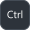
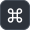

#        

A collection of pretty keyboard shortcut images with light/dark Github color schemes, three sizes, and support for Mac and Windows.

## 

The Windows design is based on the Surface 3 keyboard. However, the typeface is slightly different as I was not able to source a matching version of Segoe (see `I` and `Q`, for example).

     

Only a subset of keys are supported, feel free to open a PR or an issue to request/add more.

##   

The Mac design is a mix of the latest MacBook Pro, and the legacy Apple USB Keyboard. It has support for standard shortcut icons.

     

It also has alternative, text-based versions of the same shortcuts.

  
