## mac
## light
### small

### medium

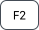
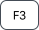
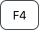

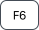
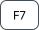

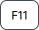

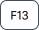
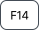
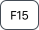
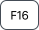
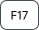
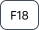

### large

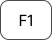
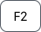
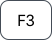
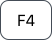
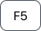
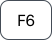
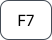
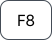
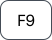
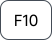
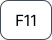
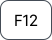
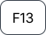
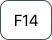
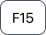
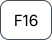
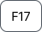
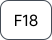

## dark
### small

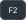

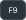

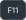
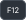
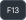
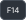

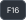
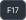

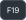

### medium

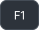
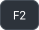

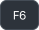

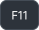
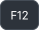
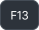
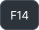

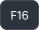
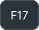
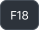
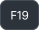

### large

## windows
## light
### small

### medium

### large

## dark
### small

### medium

### large

